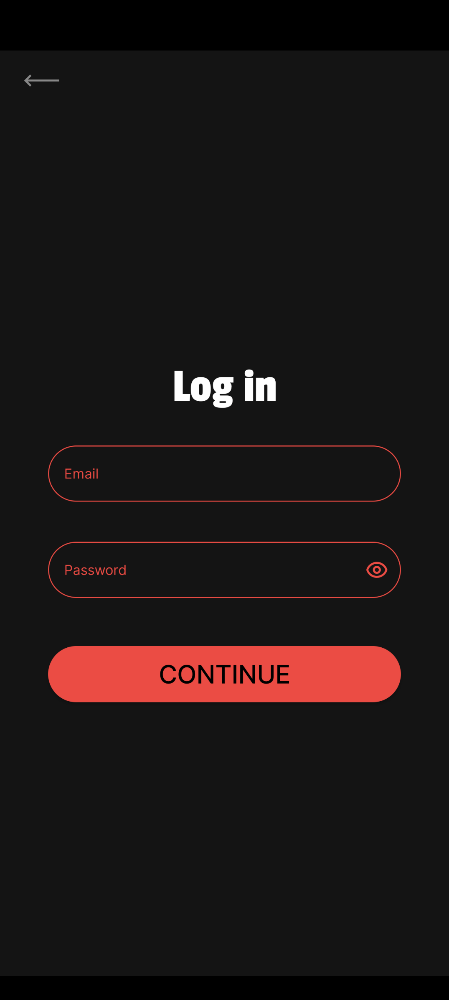
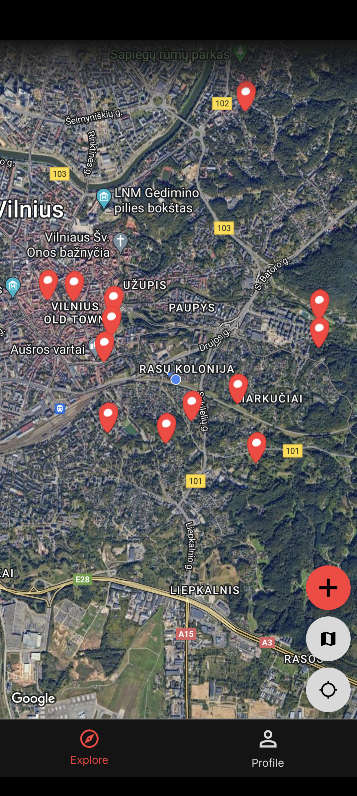
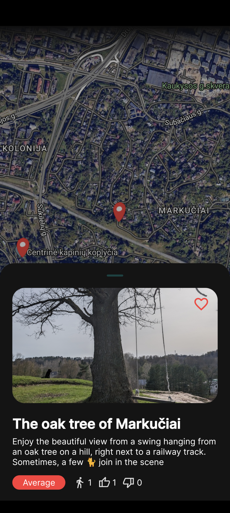
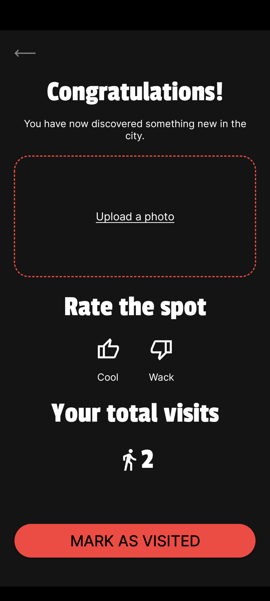
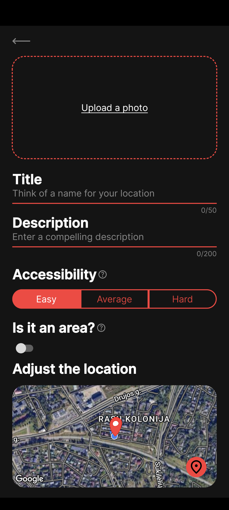
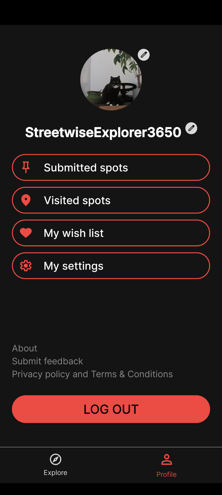
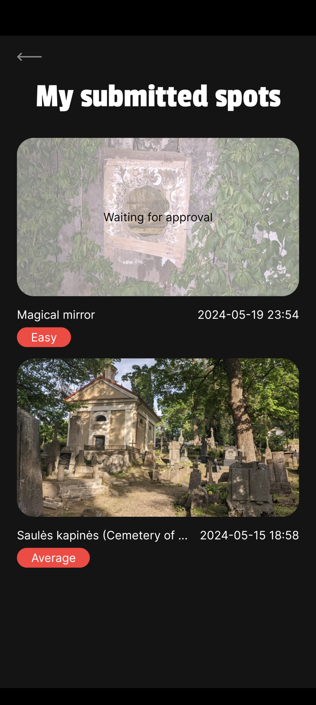
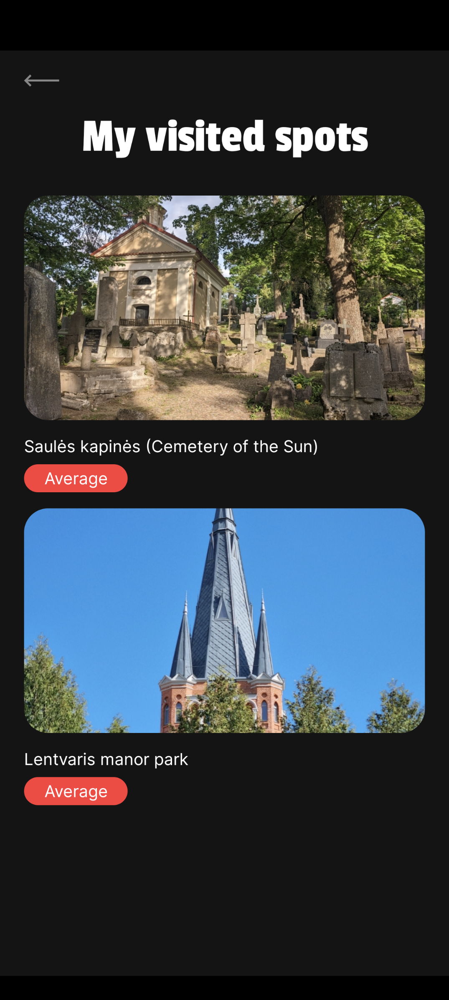
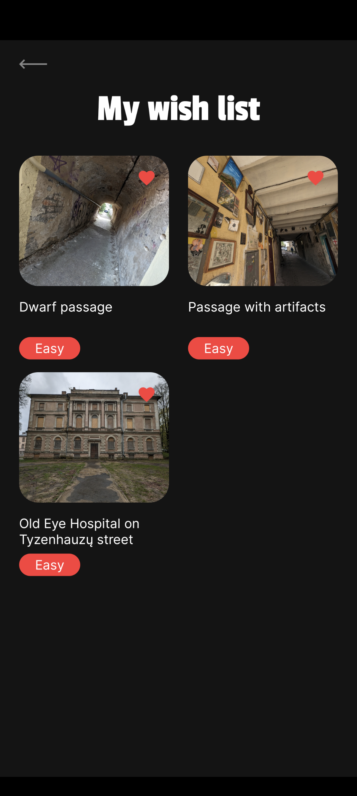

# Oddspot Frontend

Oddspot is a Kotlin (Android + iOS + Backend) project that aims to provide a platform for sharing
and discovering interesting spots around the world that aren't commercial establishments. The
project is still in its early stages of development and has not been released yet.

The sharing of this repository is meant to showcase a real life project that is being developed with
real problems/sacrifices. It may not be the cleanest architecturally or have the largest test
coverage. It is a real project that is being developed by a single developer (me) in my free time.

Backend repository - https://github.com/fc9734ygn/oddspot-backend

## Features (as of right now):

- User registration and login
- Spot discovery (map)
- Visiting spots based on user location
- Submitting spots with photos and descriptions etc.
- Wishlist
- Visit history
- Submitted spots
- Tutorial
- User profile, avatar and settings

## Screenshots
 
 
 
 
 

## Architecture Overview:

The project is built with Kotlin Multiplatform Mobile (KMM) and follows the MVVM (with a taste of
MVI) architecture pattern that's very common in modern Android development. The UI is
built for both Android and iOS with Compose Multiplatform, with just a few components built
independently for each platform (e.g., Google Maps integration).

## Technologies and Frameworks (and opinions):

### Compose Multiplatform

- Allows me to build the UI for iOS in Kotlin.

### Ktor (client)

- Allows me to use the same network client library for frontend and backend.

### SQLDelight

- Allows me to use the same database library (reverse ORM, for lack of a better word) for frontend
  and backend.

### Koin

- In my opinion, the best DI library for Kotlin projects. Supports pretty much everything Kotlin
  does.

### KSP

- Allows me to use Koin annotations.

### Voyager

- Simplifies navigation; haven't found any issues with it yet.

### Kermit

- Simple and effective logging library.

### Kotlin-result by Michael Bull

- My favorite Result/Either Monad implementation for Kotlin.
- Allows me to handle my errors explicitly and transform the exceptions into domain errors **when
  needed**.
- I try to follow the "exceptions are for exceptional cases" philosophy but without wrapping every
  Throwable into a domain error without any reason.

#### Alternatives:

- Arrow - too heavy for me.
- Result from Kotlin stdlib - doesn't allow sealed classes for error types, which is the main reason
  I use Result type.
- Other Result libraries - I prefer Michael Bull's library syntax.

Interesting read: [The Result Monad](https://adambennett.dev/2020/05/the-result-monad/)

### Other Small Libs for UI, etc.

- When it comes to the UI code, I would rather not spend too much time on it as it's not the point of this project.
- I use small libraries that do the job and don't require me to write too much code.
- As it is my own project, I can usually adjust the designs to fit the libraries I use.

### Detekt

- Allows me to have some static code analysis.

## Tests:

I haven't written any tests for the frontend (but I did for the backend) as the features and designs have been changing a lot.
Usually, in Android projects, I prioritize unit tests for the domain layer and E2E or integration
tests (JUnit 4 or 5, Compose Rule/Espresso, MockK) and then I continue with unit tests for
presentation and data layers (ViewModels and Repositories).

## Future Enhancements:

The project is still in its early stages, and there are a lot of things that need to be done.
Unfortunately, the task board is private but for the most part, it consists of additional
features and some technical improvements - crashlytics, tests, introducing viewport loading or another approach to scale the feed/explore, add CI/CD, etc.

## How to Run:

1. Deploy/run your backend.
2. Add `const val API_BASE_URL = "your-api-url"` somewhere in your commonMain directory.
3. Add `secrets.properties` to the project's root directory with the
   content `MAPS_API_KEY=your-google-maps-api-key`.
4. Add `MAPS_API_KEY=DEFAULT_API_KEY` line to your `local.properties` file (project root directory).
5. Build the app for Android or iOS following regular KMP project build procedures.

## DISCLAIMER:
The iOS project isn't building right now as I've made some changes to the map implementation that needs to be updated
in the iosMain directory. But as of right now, I have no access to a macOS machine to update and build the project.

Last update: 2024-06-25
